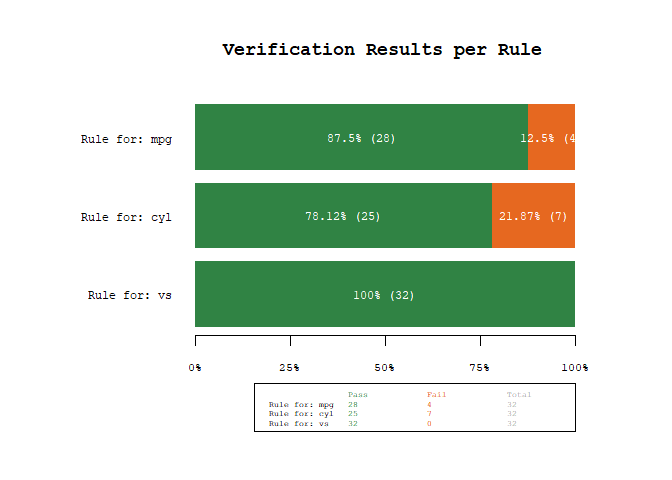
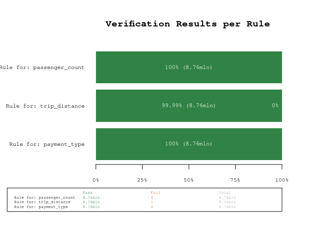

<!-- README.md is generated from README.Rmd. Please edit that file -->

# `dataverifyr` - A Lightweight, Flexible, and Fast Data Validation Package that Can Handle All Sizes of Data

<!-- badges: start -->

[](https://www.r-pkg.org/pkg/dataverifyr)
[](https://www.r-pkg.org/pkg/dataverifyr)
[](https://github.com/DavZim/dataverifyr/actions/workflows/R-CMD-check.yaml)

<!-- badges: end -->

The goal of `dataverifyr` is to allow a wide variety of flexible data
validation checks (verifications). That means, you can specify a set of
rules (R expressions) and compare any arbitrary dataset against it.

The package is built in such a way, that it adapts to your type of data
and choice of data package (data.frame, data.table, tibble, arrow, or
SQL connection) and chooses the right data backend automatically, this
is especially handy when large or complicated datasets are involved.
That way, you can concentrate on writing the rules and making sure that
your data is valid rather than spending time writing boilerplate code.

The package is lightweight as all the heavy dependencies are
Suggests-only, that means if you want to use `data.table` for the task,
you don’t need to install the other packages (`arrow`, `DBI`, etc)
unless you explicitly tell R to install all suggested packages as well
when installing the package.

The backend for your analysis is automatically chosen based on the type
of input dataset as well as the available packages (see also
`?detect_backend(data)`). By using the underlying technologies and
handing over all evaluation of code to the backend, this package can
deal with all sizes of data the backends can deal with.

The package also has a helper function to describe a dataset, see
`?describe()`.

## Installation

You can install the development version of `dataverifyr` like so:

``` r
# development version
# devtools::install_github("DavZim/dataverifyr")

# CRAN release
install.packages("dataverifyr")
```

## Example

This is a basic example which shows you how to

1.  create a rule set manually, consisting of R expressions
2.  check if a dataset matches all given rules
3.  save and load the rules to a yaml-file for better maintainability

Note that each rule is an R expression that is evaluated within the
dataset. Our first rule, for example, states that we believe all values
of the `mpg` variable are in the range 10 to 30 (exclusive). At the
moment rules work in a window/vectorized approach only, that means that
a rule like this will work `mpg > 10 * wt`, whereas a rule like this
`sum(mpg) > 0` will not work as it aggregates values.

``` r
library(dataverifyr)

# create a dataset
data <- mtcars

# define a rule set within our R code; alternatively in a yaml file
rules <- ruleset(
  rule(mpg > 10 & mpg < 30), # mpg goes up to 34
  rule(cyl %in% c(4, 8)), # missing 6 cyl
  rule(vs %in% c(0, 1), allow_na = TRUE)
)

# print the rules
rules
#> <Verification Ruleset with 3 elements>
#>   [1] 'Rule for: mpg' matching `mpg > 10 & mpg < 30` (allow_na: FALSE)
#>   [2] 'Rule for: cyl' matching `cyl %in% c(4, 8)` (allow_na: FALSE)
#>   [3] 'Rule for: vs' matching `vs %in% c(0, 1)` (allow_na: TRUE)

# describe the dataset
describe(data)
#>      var    type  n n_distinct n_na                  most_frequent    min       mean  median
#>  1:  mpg numeric 32         25    0     21 (2), 22.8 (2), 21.4 (2) 10.400  20.090625  19.200
#>  2:  cyl numeric 32          3    0          8 (14), 4 (11), 6 (7)  4.000   6.187500   6.000
#>  3: disp numeric 32         27    0    275.8 (3), 160 (2), 360 (2) 71.100 230.721875 196.300
#>  4:   hp numeric 32         22    0      110 (3), 175 (3), 180 (3) 52.000 146.687500 123.000
#>  5: drat numeric 32         22    0    3.92 (3), 3.07 (3), 3.9 (2)  2.760   3.596563   3.695
#>  6:   wt numeric 32         29    0   3.44 (3), 3.57 (2), 2.62 (1)  1.513   3.217250   3.325
#>  7: qsec numeric 32         30    0 17.02 (2), 18.9 (2), 16.46 (1) 14.500  17.848750  17.710
#>  8:   vs numeric 32          2    0        0 (18), 1 (14), NA (NA)  0.000   0.437500   0.000
#>  9:   am numeric 32          2    0        0 (19), 1 (13), NA (NA)  0.000   0.406250   0.000
#> 10: gear numeric 32          3    0          3 (15), 4 (12), 5 (5)  3.000   3.687500   4.000
#> 11: carb numeric 32          6    0          4 (10), 2 (10), 1 (7)  1.000   2.812500   2.000
#>         max          sd
#>  1:  33.900   6.0269481
#>  2:   8.000   1.7859216
#>  3: 472.000 123.9386938
#>  4: 335.000  68.5628685
#>  5:   4.930   0.5346787
#>  6:   5.424   0.9784574
#>  7:  22.900   1.7869432
#>  8:   1.000   0.5040161
#>  9:   1.000   0.4989909
#> 10:   5.000   0.7378041
#> 11:   8.000   1.6152000

# check if the data matches our rules
res <- check_data(data, rules)
res
#>             name                expr allow_na negate tests pass fail warn error              time
#> 1: Rule for: mpg mpg > 10 & mpg < 30    FALSE  FALSE    32   28    4            0.0010831356 secs
#> 2: Rule for: cyl    cyl %in% c(4, 8)    FALSE  FALSE    32   25    7            0.0033519268 secs
#> 3:  Rule for: vs     vs %in% c(0, 1)     TRUE  FALSE    32   32    0            0.0005369186 secs
```

As we can see, our dataset `mtcars` does not conform to all of our
rules. We have four fails (fail=rule is not met) for the first rule
`mpg > 10 & mpg < 30` (there are `mpg` values up to 33.9) and seven
fails for the second rule `cyl %in% c(4, 8)` (there are `cyl` values of
6), while the third rule `vs %in% c(0, 1)` is always met.

To see which values do not meet our expectations, use the
`filter_fails()` function

``` r
filter_fails(res, mtcars, per_rule = TRUE)
#> $`mpg > 10 & mpg < 30`
#>     mpg cyl disp  hp drat    wt  qsec vs am gear carb
#> 1: 32.4   4 78.7  66 4.08 2.200 19.47  1  1    4    1
#> 2: 30.4   4 75.7  52 4.93 1.615 18.52  1  1    4    2
#> 3: 33.9   4 71.1  65 4.22 1.835 19.90  1  1    4    1
#> 4: 30.4   4 95.1 113 3.77 1.513 16.90  1  1    5    2
#> 
#> $`cyl %in% c(4, 8)`
#>     mpg cyl  disp  hp drat    wt  qsec vs am gear carb
#> 1: 21.0   6 160.0 110 3.90 2.620 16.46  0  1    4    4
#> 2: 21.0   6 160.0 110 3.90 2.875 17.02  0  1    4    4
#> 3: 21.4   6 258.0 110 3.08 3.215 19.44  1  0    3    1
#> 4: 18.1   6 225.0 105 2.76 3.460 20.22  1  0    3    1
#> 5: 19.2   6 167.6 123 3.92 3.440 18.30  1  0    4    4
#> 6: 17.8   6 167.6 123 3.92 3.440 18.90  1  0    4    4
#> 7: 19.7   6 145.0 175 3.62 2.770 15.50  0  1    5    6
```

We can also visualize the results using the `plot_res()` function.

``` r
plot_res(res)
```



Note that you can also save and load a ruleset to and from a `yaml` file

``` r
write_rules(rules, "example_rules.yaml")
r2 <- read_rules("example_rules.yaml")
identical(rules, r2)
#> [1] TRUE
```

The resulting `example_rules.yaml` looks like this

``` yaml
- name: 'Rule for: mpg'
  expr: mpg > 10 & mpg < 30
  allow_na: no
  negate: no
  index: 1
- name: 'Rule for: cyl'
  expr: cyl %in% c(4, 8)
  allow_na: no
  negate: no
  index: 2
- name: 'Rule for: vs'
  expr: vs %in% c(0, 1)
  allow_na: yes
  negate: no
  index: 3
```

One helpful use case is to use this functionality to assert that your
data has the right values in a custom read function like so:

``` r
read_custom <- function(file, rules) {
  data <- read.csv(file) # or however you read in your data
  # if the check_data detects a fail: the read_custom function will stop
  check_data(data, rules, xname = file,
             stop_on_fail = TRUE, stop_on_warn = TRUE, stop_on_error = TRUE)
  # ...
  data
}
# nothing happens when the data matches the rules
data <- read_custom("correct_data.csv", rules)

# an error is thrown when warnings or errors are found
data <- read_custom("wrong_data.csv", rules)
#> Error in check_data(data, rules, stop_on_fail = TRUE, stop_on_error = TRUE, stop_on_warn = TRUE) : 
#>   In dataset 'wrong_data.csv' found 2 rule fails, 1 warnings, 1 errors
```

## Backends

At the moment the following backends are supported. Note that they are
automatically chosen based on data type and package availability. Eg,
when the dataset is a `dplyr::tbl()` connected to an `SQLite` database,
the package will automatically choose `RSQLite`/`DBI`/`dbplyr` for the
task. To see which backend `dataverifyr` would use for a task, you can
use `detect_backend(data)`.

<table>
<thead class="header">
<th style="text-align:left;">
Backend / Library
</th>
<th style="text-align:center;">
Status
</th>
<th style="text-align:left;">
Data Type
</th>
<th style="text-align:left;">
Example Code
</th>
<th style="text-align:left;">
Comment
</th>
</thead>
<tbody>
<tr class="odd">
<td style="text-align:left;">

`base-R`

</td>
<td style="text-align:center;">
✔️
</td>
<td style="text-align:left;">

`data.frame`

</td>
<td style="text-align:left;">

``` r
data <- data.frame(x = 1:10)
check_data(data, rs)
```

</td>
<td style="text-align:left;">

When `data.table` or `dplyr` are available, they are used for faster
speeds.

</td>
</tr>
<tr class="even">
<td style="text-align:left;">

[`dplyr`](https://dplyr.tidyverse.org/)

</td>
<td style="text-align:center;">
✔️
</td>
<td style="text-align:left;">

`tibble`

</td>
<td style="text-align:left;">

``` r
library(dplyr)
data <- tibble(x = 1:10)
check_data(data, rs)
```

</td>
<td style="text-align:left;">
</td>
</tr>
<tr class="odd">
<td style="text-align:left;">

[`data.table`](https://r-datatable.com)

</td>
<td style="text-align:center;">
✔️
</td>
<td style="text-align:left;">

`data.table`

</td>
<td style="text-align:left;">

``` r
library(data.table)
data <- data.table(x = 1:10)
check_data(data, rs)
```

</td>
<td style="text-align:left;">
</td>
</tr>
<tr class="even">
<td style="text-align:left;">

[`arrow`](https://arrow.apache.org/docs/r/)

</td>
<td style="text-align:center;">
✔️
</td>
<td style="text-align:left;">

`Table`, `ArrowTabular`, `ArrowObject`

</td>
<td style="text-align:left;">

``` r
library(arrow)
data <- arrow_table(x = 1:10)
# Alternatively:
data <- read_parquet(
  file,
  as_data_frame = FALSE
)
check_data(data, rs)
```

</td>
<td style="text-align:left;">
</td>
</tr>
<tr class="odd">
<td style="text-align:left;">

[`arrow`](https://arrow.apache.org/docs/r/)

</td>
<td style="text-align:center;">
✔️
</td>
<td style="text-align:left;">

`FileSystemDataset`, `Dataset`, `ArrowObject`

</td>
<td style="text-align:left;">

``` r
library(arrow)
data <- open_dataset(dir)
check_data(data, rs)
```

</td>
<td style="text-align:left;">
Especially handy for large datasets
</td>
</tr>
<tr class="even">
<td style="text-align:left;">

[`RSQLite`](https://rsqlite.r-dbi.org/),
[`DBI`](https://dbi.r-dbi.org/), and
[`dbplyr`](https://dbplyr.tidyverse.org/)

</td>
<td style="text-align:center;">
✔️
</td>
<td style="text-align:left;">

`tbl_SQLiteConnection`, `tbl_dbi`, `tbl_sql`, `tbl_lazy`, `tbl`

</td>
<td style="text-align:left;">

``` r
library(DBI)
con <- dbConnect(RSQLite::SQLite())
# dbWriteTable(con, tablename, data)
tbl <- dplyr::tbl(con, tablename)
check_data(tbl, rs)

dbDisconnect(con)
```

</td>
<td style="text-align:left;">

Note that missing values are converted to `0` when using sqlite by
default ([c.f. this SO
answer](https://stackoverflow.com/a/57746647/3048453))

</td>
</tr>
<tr class="odd">
<td style="text-align:left;">

[`duckdb`](https://duckdb.org/docs/api/r.html),
[`DBI`](https://dbi.r-dbi.org/), and
[`dbplyr`](https://dbplyr.tidyverse.org/)

</td>
<td style="text-align:center;">
✔️
</td>
<td style="text-align:left;">

`tbl_duckdb_connection`, `tbl_dbi`, `tbl_sql`, `tbl_lazy`, `tbl`

</td>
<td style="text-align:left;">

``` r
library(DBI)
con <- dbConnect(duckdb::duckdb())
# dbWriteTable(con, tablename, data)
tbl <- dplyr::tbl(con, tablename)
check_data(tbl, rs)

dbDisconnect(con, shutdown = TRUE)
```

</td>
<td style="text-align:left;">
</td>
</tr>
<tr class="even">
<td style="text-align:left;">

[`RPostgres`](https://rpostgres.r-dbi.org/),
[`DBI`](https://dbi.r-dbi.org/), and
[`dbplyr`](https://dbplyr.tidyverse.org/)

</td>
<td style="text-align:center;">
❓
</td>
<td style="text-align:left;">

`tbl_PqConnection`, `tbl_dbi`, `tbl_sql`, `tbl_lazy`, `tbl`

</td>
<td style="text-align:left;">

``` r
library(DBI)
con <- dbConnect(
  RPostgres::Postgres(), 
  ...
)
# dbWriteTable(con, tablename, data)
tbl <- dplyr::tbl(con, tablename)
check_data(tbl, rs)

dbDisconnect(con)
```

</td>
<td style="text-align:left;">

Not tested, but should work out-of-the-box using
[`DBI`](https://dbi.r-dbi.org/)

</td>
</tr>
</tbody>
</table>

Note that the `rs` object in the example code above refers to a
`ruleset()`. Larger complete examples can be found below.

## Larger Example using the `arrow` backend

For a more involved example, using a different backend, let’s say we
have a larger dataset of taxi trips from NY (see also the official
[source of the
data](https://www.nyc.gov/site/tlc/about/tlc-trip-record-data.page)),
that we have saved as a local arrow dataset (using parquet as a data
format), where we want to make sure that some variables are in-line with
our expectations/rules.

### 1 Download and Prepare Data

First we prepare the data by downloading it and writing the dataset to
`.parquet` files. This needs to be done only once and is shown for
reproducibility reasons only, the actual `dataverifyr` code is shown
below the next block

``` r
library(arrow)
url <- "https://d37ci6vzurychx.cloudfront.net/trip-data/yellow_tripdata_2018-01.parquet"
file <- "yellow_tripdata_2018-01.parquet"
if (!file.exists(file)) download.file(url, file, method = "curl")
file.size(file) / 1e6 # in MB
#> [1] 123.6685

# quick check of the filesize
d <- open_dataset(file)
describe(d)
#> # A tibble: 19 × 10
#>    var                  type  n_dis…¹    n_na most_…²     min      mean   median       max        sd
#>    <chr>                <chr>   <int>   <int> <chr>     <dbl>     <dbl>    <dbl>     <dbl>     <dbl>
#>  1 VendorID             inte…       2       0 2 (491…    1      1.5610    2           2     0.49508 
#>  2 tpep_pickup_datetime POSI… 2311532       0 2018-0…   NA     NA        NA          NA    NA       
#>  3 tpep_dropoff_dateti… POSI… 2315089       0 2018-0…   NA     NA        NA          NA    NA       
#>  4 passenger_count      inte…      10       0 1 (624…    0      1.6068    1           9     1.2330  
#>  5 trip_distance        nume…    4397       0 0.8 (2…    0      2.8040    1.5503 189484.    3.2532  
#>  6 RatecodeID           inte…       7       0 1 (853…    1      1.0395    1          99     0.31301 
#>  7 store_and_fwd_flag   char…       2       0 N (872…    1      1         1           1     0       
#>  8 PULocationID         inte…     259       0 237 (3…    1    164.46    161.86      265    66.520   
#>  9 DOLocationID         inte…     261       0 236 (3…    1    162.73    162.10      265    75.411   
#> 10 payment_type         inte…       4       0 1 (610…    1      1.3106    1           4     0.45814 
#> 11 fare_amount          nume…    1714       0 6 (473… -450     12.244     8.8357   8016     9.9255  
#> 12 extra                nume…      42       0 0 (474…  -44.69   0.32469   0          60     0.068786
#> 13 mta_tax              nume…      15       0 0.5 (8…   -0.5    0.49751   0.5        45.49  0.043389
#> 14 tip_amount           nume…    3397       0 0 (289…  -88.8    1.8188    1.3968    441.71  2.2823  
#> 15 tolls_amount         nume…     967       0 0 (833…  -15      0.30262   0         950.7   1.1501  
#> 16 improvement_surchar… nume…       4       0 0.3 (8…   -0.3    0.29963   0.3         1     0.018442
#> 17 total_amount         nume…   11514       0 7.3 (2… -450.3   15.491    11.321    8016.8  11.984   
#> 18 congestion_surcharge nume…       2 8760675 NA (87…    2.5    2.5       2.5         2.5  NA       
#> 19 airport_fee          nume…       2 8760675 NA (87…    0      0         0           0    NA       
#> # … with abbreviated variable names ¹​n_distinct, ²​most_frequent

# write the dataset to disk
write_dataset(d, "nyc-taxi-data")
```

### 2 Create Rules in `yaml`

Next, we can create some rules that we will use to check our data. As we
saw earlier, we can create the rules in R using the `rule()` and
`ruleset()` functions, there is however, the (in my opinion) preferred
option to separate the code from the rules by writing the rules in a
separate yaml file and reading them into R.

First we display the hand-written contents of the `nyc_data_rules.yaml`
file.

``` yaml
- name: 'Rule for: passenger_count'
  expr: passenger_count >= 0 & passenger_count <= 10
  allow_na: no
  negate: no
  index: 1
- name: 'Rule for: trip_distance'
  expr: trip_distance >= 0 & trip_distance <= 1000
  allow_na: no
  negate: no
  index: 2
- name: 'Rule for: payment_type'
  expr: payment_type %in% c(0, 1, 2, 3, 4)
  allow_na: no
  negate: no
  index: 3
```

Then, we can load, display, and finally check the rules against the data

``` r
rules <- read_rules("nyc_data_rules.yaml")
rules
#> <Verification Ruleset with 3 elements>
#>   [1] 'Rule for: passenger_count' matching `passenger_count >= 0 & passenger_count <= 10` (allow_na: FALSE)
#>   [2] 'Rule for: trip_distance' matching `trip_distance >= 0 & trip_distance <= 1000` (allow_na: FALSE)
#>   [3] 'Rule for: payment_type' matching `payment_type %in% c(0, 1, 2, 3, 4)` (allow_na: FALSE)
```

### 3 Verify that the Data matches the given Rules

Now we can check if the data follows our rules or if we have unexpected
data points:

``` r
# open the dataset 
ds <- open_dataset("nyc-taxi-data/")

# perform the data validation check
res <- check_data(ds, rules)
res
#> # A tibble: 3 × 10
#>   name                      expr              allow…¹ negate   tests    pass  fail warn  error time 
#>   <chr>                     <chr>             <lgl>   <lgl>    <int>   <int> <int> <chr> <chr> <drt>
#> 1 Rule for: passenger_count passenger_count … FALSE   FALSE  8760687 8760687     0 ""    ""    0.42…
#> 2 Rule for: trip_distance   trip_distance >=… FALSE   FALSE  8760687 8760686     1 ""    ""    0.51…
#> 3 Rule for: payment_type    payment_type %in… FALSE   FALSE  8760687 8760687     0 ""    ""    0.45…
#> # … with abbreviated variable name ¹​allow_na

plot_res(res)
```



Using the power of `arrow`, we were able to scan 8+mln observations for
three rules in about 1.5 seconds (YMMV). As we can see from the results,
there is one unexpected value, lets quickly investigate using the
`filter_fails()` function, which filters a dataset for the failed rule
matches

``` r
res |>
  filter_fails(ds) |> 
  # only select a couple of variables for brevity
  dplyr::select(tpep_pickup_datetime, tpep_dropoff_datetime, trip_distance)
#> # A tibble: 1 × 3
#>   tpep_pickup_datetime tpep_dropoff_datetime trip_distance
#>   <dttm>               <dttm>                        <dbl>
#> 1 2018-01-30 12:41:02  2018-01-30 12:42:09         189484.
```

As we can see, this is probably a data error (a trip distance of 190k
miles in 1 minute seems - ehm stellar…).

## Using a `DBI` Backend

If you have a `SQLite` or `duckdb` database, you can use the package
like this

``` r
library(DBI)
library(dplyr)

# connect to a duckdb database
con <- dbConnect(duckdb::duckdb("duckdb-database.duckdb"))
# for demo purposes write the data once
dbWriteTable(con, "mtcars", mtcars)

# create a tbl connection, which can be used in the checks
tbl <- tbl(con, "mtcars")

# create rules
rules <- ruleset(
  rule(mpg > 10 & mpg < 30),
  rule(cyl %in% c(4, 8)),
  rule(vs %in% c(0, 1), allow_na = TRUE)
)

# check rules
res <- check_data(tbl, rules)
res
#> # A tibble: 3 × 10
#>   name          expr                allow_na negate tests  pass  fail warn  error time          
#>   <chr>         <chr>               <lgl>    <lgl>  <dbl> <dbl> <dbl> <chr> <chr> <drtn>        
#> 1 Rule for: mpg mpg > 10 & mpg < 30 FALSE    FALSE     32    28     4 ""    ""    4.4900761 secs
#> 2 Rule for: cyl cyl %in% c(4, 8)    FALSE    FALSE     32    25     7 ""    ""    0.1926301 secs
#> 3 Rule for: vs  vs %in% c(0, 1)     TRUE     FALSE     32    32     0 ""    ""    0.2003391 secs

filter_fails(res, tbl, per_rule = TRUE)
#> $`mpg > 10 & mpg < 30`
#> # A tibble: 4 × 11
#>     mpg   cyl  disp    hp  drat    wt  qsec    vs    am  gear  carb
#>   <dbl> <dbl> <dbl> <dbl> <dbl> <dbl> <dbl> <dbl> <dbl> <dbl> <dbl>
#> 1  32.4     4  78.7    66  4.08 2.2   19.47     1     1     4     1
#> 2  30.4     4  75.7    52  4.93 1.615 18.52     1     1     4     2
#> 3  33.9     4  71.1    65  4.22 1.835 19.9      1     1     4     1
#> 4  30.4     4  95.1   113  3.77 1.513 16.9      1     1     5     2
#> 
#> $`cyl %in% c(4, 8)`
#> # A tibble: 7 × 11
#>     mpg   cyl  disp    hp  drat    wt  qsec    vs    am  gear  carb
#>   <dbl> <dbl> <dbl> <dbl> <dbl> <dbl> <dbl> <dbl> <dbl> <dbl> <dbl>
#> 1  21       6 160     110  3.9  2.62  16.46     0     1     4     4
#> 2  21       6 160     110  3.9  2.875 17.02     0     1     4     4
#> 3  21.4     6 258     110  3.08 3.215 19.44     1     0     3     1
#> 4  18.1     6 225     105  2.76 3.46  20.22     1     0     3     1
#> 5  19.2     6 167.6   123  3.92 3.44  18.3      1     0     4     4
#> 6  17.8     6 167.6   123  3.92 3.44  18.9      1     0     4     4
#> 7  19.7     6 145     175  3.62 2.77  15.5      0     1     5     6

# lastly disconnect from the database again
dbDisconnect(con, shutdown = TRUE)
```

# Alternative Data Validation R Libraries

If this library is not what you are looking for, the following might be
good alternatives to validate your data:

- [`pointblank`](https://rich-iannone.github.io/pointblank/)
- [`validate`](https://github.com/data-cleaning/validate)
- [`data.validator`](https://github.com/Appsilon/data.validator)
