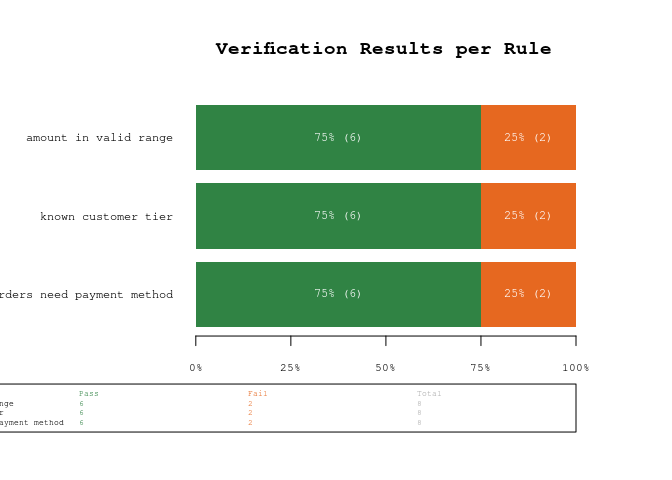
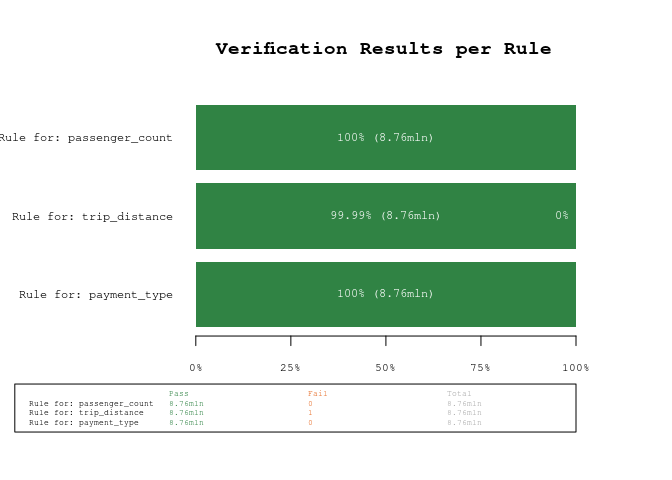

<!-- README.md is generated from README.Rmd. Please edit that file -->

# `dataverifyr` - A Lightweight, Flexible, and Fast Data Validation Package that Can Handle All Sizes of Data

<!-- badges: start -->

[](https://www.r-pkg.org/pkg/dataverifyr)
[](https://www.r-pkg.org/pkg/dataverifyr)
[](https://github.com/DavZim/dataverifyr/actions/workflows/R-CMD-check.yaml)

<!-- badges: end -->

The goal of `dataverifyr` is to allow a wide variety of flexible data
validation checks (verifications). That means, you can specify a set of
rules (R expressions) and compare any arbitrary dataset against it.

The package is built in such a way, that it adapts to your type of data
and choice of data package (data.frame, data.table, tibble, arrow, or
SQL connection) and chooses the right data backend automatically, this
is especially handy when large or complicated datasets are involved.
That way, you can concentrate on writing the rules and making sure that
your data is valid rather than spending time writing boilerplate code.

The package is lightweight as all the heavy dependencies are
Suggests-only, that means if you want to use `data.table` for the task,
you don’t need to install the other packages (`arrow`, `DBI`, etc)
unless you explicitly tell R to install all suggested packages as well
when installing the package.

The backend for your analysis is automatically chosen based on the type
of input dataset as well as the available packages (see also
`?detect_backend(data)`). By using the underlying technologies and
handing over all evaluation of code to the backend, this package can
deal with all sizes of data the backends can deal with.

The package also has a helper function to describe a dataset, see
`?describe()`.

## Installation

You can install the development version of `dataverifyr` like so:

``` r
# development version
# devtools::install_github("DavZim/dataverifyr")

# CRAN release
install.packages("dataverifyr")
```

## Example

This is a basic example which shows you how to

1.  create a rule set manually, consisting of R expressions
2.  check if a dataset matches all given rules
3.  save and load the rules to a yaml-file for better maintainability

Note that each rule is an R expression that is evaluated within the
dataset. Our first rule, for example, states that we expect all `amount`
values to be in a sensible range. At the moment rules work in a
window/vectorized approach only, that means that a rule like this will
work `amount > 10 * as.numeric(paid)`, whereas a rule like this
`sum(amount) > 0` will not work as it aggregates values.

``` r
library(dataverifyr)

# use the packaged demo dataset (includes NAs + datetime)
data <- sample_data

# define a rule set within our R code; alternatively in a yaml file
rules <- ruleset(
  rule(amount >= 0 & amount <= 10000, name = "amount in valid range"),
  rule(customer_tier %in% c("bronze", "silver", "gold"), name = "known customer tier"),
  rule(!paid | payment_method != "none", name = "paid orders need payment method")
)

# print the rules
rules
#> <Verification Ruleset with 3 elements>
#>   [1] 'amount in valid range' matching `amount >= 0 & amount <= 10000` (allow_na: FALSE)
#>   [2] 'known customer tier' matching `customer_tier %in% c("bronze", "silver", "gold")` (allow_na: FALSE)
#>   [3] 'paid orders need payment method' matching `!paid | payment_method != "none"` (allow_na: FALSE)

# describe the dataset
describe(data)
#>               var      type     n n_distinct  n_na                    most_frequent        min
#>            <char>    <char> <int>      <int> <int>                           <char>      <num>
#> 1:       order_id   integer     8          8     0                                           1
#> 2:  customer_tier character     8          5     1 gold (2), silver (2), bronze (2)          4
#> 3:         amount   numeric     8          8     1                                          -5
#> 4:           paid   logical     8          3     1              TRUE (5), FALSE (2)          4
#> 5: payment_method character     8          4     1               card (3), none (3)          4
#> 6:     order_time   POSIXct     8          8     1                                  1735722000
#>            mean       median          max           sd
#>           <num>        <num>        <num>        <num>
#> 1: 4.500000e+00          4.5 8.000000e+00 2.449490e+00
#> 2: 5.571429e+00          6.0 7.000000e+00 1.133893e+00
#> 3: 9.440571e+01         80.0 3.202500e+02 1.104161e+02
#> 4: 4.285714e+00          4.0 5.000000e+00 4.879500e-01
#> 5: 4.000000e+00          4.0 4.000000e+00 0.000000e+00
#> 6: 1.736029e+09 1736005500.0 1.736334e+09 2.318349e+05

# check if the data matches our rules
res <- check_data(data, rules)
res
#>    check_type                            name                                             expr
#>        <char>                          <char>                                           <char>
#> 1:   row_rule           amount in valid range                    amount >= 0 & amount <= 10000
#> 2:   row_rule             known customer tier customer_tier %in% c("bronze", "silver", "gold")
#> 3:   row_rule paid orders need payment method                 !paid | payment_method != "none"
#>    allow_na negate tests  pass  fail   warn  error             time
#>      <lgcl> <lgcl> <int> <int> <int> <char> <char>       <difftime>
#> 1:    FALSE  FALSE     8     6     2               0.001636744 secs
#> 2:    FALSE  FALSE     8     6     2               0.003160954 secs
#> 3:    FALSE  FALSE     8     6     2               0.000418663 secs
```

As we can see, this demo dataset does not conform to all of our rules.
There is one negative amount, one unknown customer tier, and one row
where `paid == TRUE` but `payment_method == "none"`. The dataset also
contains missing values and a datetime column (`order_time`) to mirror
common real data inputs.

To see which values do not meet our expectations, use the
`filter_fails()` function

``` r
filter_fails(res, data, per_rule = TRUE)
#> $`amount >= 0 & amount <= 10000`
#>    order_id customer_tier amount   paid payment_method          order_time
#>       <int>        <char>  <num> <lgcl>         <char>              <POSc>
#> 1:        3        bronze     -5  FALSE           none 2025-01-03 12:15:00
#> 2:        6        silver     NA     NA           card 2025-01-06 08:10:00
#> 
#> $`customer_tier %in% c("bronze", "silver", "gold")`
#>    order_id customer_tier amount   paid payment_method          order_time
#>       <int>        <char>  <num> <lgcl>         <char>              <POSc>
#> 1:        5          <NA>  45.10  FALSE           none                <NA>
#> 2:        8       unknown  99.99   TRUE           none 2025-01-08 11:05:00
#> 
#> $`!paid | payment_method != "none"`
#>    order_id customer_tier amount   paid payment_method          order_time
#>       <int>        <char>  <num> <lgcl>         <char>              <POSc>
#> 1:        6        silver     NA     NA           card 2025-01-06 08:10:00
#> 2:        7        bronze   0.00   TRUE           <NA> 2025-01-07 17:20:00
#> 3:        8       unknown  99.99   TRUE           none 2025-01-08 11:05:00
```

We can also visualize the results using the `plot_res()` function.

``` r
plot_res(res)
```



Note that you can also save and load a ruleset to and from a structured
`yaml` file

``` r
write_rules(rules, "example_rules_v1.yaml", format = "v1")
r2 <- read_rules("example_rules_v1.yaml")
identical(rules, r2)
#> [1] FALSE
```

The resulting `example_rules_v1.yaml` looks like this

``` yaml
meta: ~
data-columns: []
data-rules:
- name: amount in valid range
  expr: amount >= 0 & amount <= 10000
  allow_na: no
  negate: no
  index: 1
- name: known customer tier
  expr: customer_tier %in% c("bronze", "silver", "gold")
  allow_na: no
  negate: no
  index: 2
- name: paid orders need payment method
  expr: '!paid | payment_method != "none"'
  allow_na: no
  negate: no
  index: 3
```

`dataverifyr` uses structured v1 YAML (`meta` + `data-columns` +
`data-rules`) in the main workflow.

One helpful use case is to use this functionality to assert that your
data has the right values in a custom read function like so:

``` r
read_custom <- function(file, rules) {
  data <- read.csv(file) # or however you read in your data
  # if the check_data detects a fail: the read_custom function will stop
  check_data(data, rules, xname = file,
             stop_on_fail = TRUE, stop_on_warn = TRUE, stop_on_error = TRUE)
  # ...
  data
}
# nothing happens when the data matches the rules
data <- read_custom("correct_data.csv", rules)

# an error is thrown when warnings or errors are found
data <- read_custom("wrong_data.csv", rules)
#> Error in check_data(data, rules, stop_on_fail = TRUE, stop_on_error = TRUE, stop_on_warn = TRUE) :
#>   In dataset 'wrong_data.csv' found 2 rule fails, 1 warnings, 1 errors
```

## Row-Based Checks vs Column-Based Checks

`dataverifyr` supports two complementary layers of validation:

1.  **Row-based checks** with `rule()`  
    These answer questions like: “Is each value in a valid range?” or
    “Does each row satisfy a logical condition?”.
2.  **Column-based checks** with `data_columns` in `ruleset()`  
    These answer questions like: “Does this column exist?”, “Is it
    required?”, and “Does it have the expected type?”.

The important idea is:

- `rule()` is about **values inside rows**.
- `data_column()` is about the **declared structure (schema)** of the
  dataset.

### Row-Based Rules (value checks)

``` r
library(dataverifyr)

row_rules <- ruleset(
  rule(amount > 0, name = "amount is positive", allow_na = TRUE),
  rule(customer_tier %in% c("bronze", "silver", "gold"), name = "known customer tier", allow_na = TRUE),
  rule(!paid | payment_method != "none", name = "paid orders require payment method", allow_na = TRUE)
)

x <- sample_data

check_data(x, row_rules)
#>    check_type                               name                                             expr
#>        <char>                             <char>                                           <char>
#> 1:   row_rule                 amount is positive                                       amount > 0
#> 2:   row_rule                known customer tier customer_tier %in% c("bronze", "silver", "gold")
#> 3:   row_rule paid orders require payment method                 !paid | payment_method != "none"
#>    allow_na negate tests  pass  fail   warn  error              time
#>      <lgcl> <lgcl> <int> <int> <int> <char> <char>        <difftime>
#> 1:     TRUE  FALSE     8     6     2               0.0005500317 secs
#> 2:     TRUE  FALSE     8     7     1               0.0004150867 secs
#> 3:     TRUE  FALSE     8     7     1               0.0004053116 secs
```

The result tells you, for each rule, how many rows passed/failed and
whether warnings/errors occurred during evaluation.

### Column-Based Rules (schema checks)

Column checks are attached to the `ruleset()` via `data_columns`.

``` r
schema_rules <- ruleset(
  rule(amount > 0, name = "amount is positive", allow_na = TRUE),
  data_columns = list(
    data_column("order_id", type = "int", optional = FALSE, description = "Primary key"),
    data_column("customer_tier", type = "str", optional = FALSE),
    data_column("amount", type = "double", optional = FALSE),
    data_column("paid", type = "logical", optional = FALSE),
    data_column("payment_method", type = "str", optional = FALSE),
    data_column("order_time", optional = TRUE)
  )
)

x_ok <- sample_data

check_data(x_ok, schema_rules)
#>     check_type                                           name
#>         <char>                                         <char>
#>  1:     schema               Schema: column 'order_id' exists
#>  2:     schema       Schema: column 'order_id' has type 'int'
#>  3:     schema          Schema: column 'customer_tier' exists
#>  4:     schema  Schema: column 'customer_tier' has type 'str'
#>  5:     schema                 Schema: column 'amount' exists
#>  6:     schema      Schema: column 'amount' has type 'double'
#>  7:     schema                   Schema: column 'paid' exists
#>  8:     schema       Schema: column 'paid' has type 'logical'
#>  9:     schema         Schema: column 'payment_method' exists
#> 10:     schema Schema: column 'payment_method' has type 'str'
#> 11:     schema             Schema: column 'order_time' exists
#> 12:   row_rule                             amount is positive
#>                                       expr allow_na negate tests  pass  fail   warn  error
#>                                     <char>   <lgcl> <lgcl> <int> <int> <int> <char> <char>
#>  1:              column_exists('order_id')    FALSE  FALSE     1     1     0              
#>  2:       column_type('order_id') == 'int'    FALSE  FALSE     1     1     0              
#>  3:         column_exists('customer_tier')    FALSE  FALSE     1     1     0              
#>  4:  column_type('customer_tier') == 'str'    FALSE  FALSE     1     1     0              
#>  5:                column_exists('amount')    FALSE  FALSE     1     1     0              
#>  6:      column_type('amount') == 'double'    FALSE  FALSE     1     1     0              
#>  7:                  column_exists('paid')    FALSE  FALSE     1     1     0              
#>  8:       column_type('paid') == 'logical'    FALSE  FALSE     1     1     0              
#>  9:        column_exists('payment_method')    FALSE  FALSE     1     1     0              
#> 10: column_type('payment_method') == 'str'    FALSE  FALSE     1     1     0              
#> 11:            column_exists('order_time')    FALSE  FALSE     1     1     0              
#> 12:                             amount > 0     TRUE  FALSE     8     6     2              
#>                  time
#>            <difftime>
#>  1: 0.0000000000 secs
#>  2: 0.0000000000 secs
#>  3: 0.0000000000 secs
#>  4: 0.0000000000 secs
#>  5: 0.0000000000 secs
#>  6: 0.0000000000 secs
#>  7: 0.0000000000 secs
#>  8: 0.0000000000 secs
#>  9: 0.0000000000 secs
#> 10: 0.0000000000 secs
#> 11: 0.0000000000 secs
#> 12: 0.0003836155 secs
```

In this setup:

- `order_id`, `customer_tier`, `amount`, `paid`, and `payment_method`
  must exist (`optional = FALSE`)
- `order_time` is optional in the schema declaration
- row rules still run as usual (`amount > 0`)

### Handling extra columns

If your input has columns not declared in `data_columns`, use
`extra_columns`:

``` r
x_extra <- sample_data
x_extra$unexpected_col <- c("a", "b", "c", "d", "e", "f", "g", "h")

# default: ignore undeclared columns
check_data(x_extra, schema_rules, extra_columns = "ignore")
#>     check_type                                           name
#>         <char>                                         <char>
#>  1:     schema               Schema: column 'order_id' exists
#>  2:     schema       Schema: column 'order_id' has type 'int'
#>  3:     schema          Schema: column 'customer_tier' exists
#>  4:     schema  Schema: column 'customer_tier' has type 'str'
#>  5:     schema                 Schema: column 'amount' exists
#>  6:     schema      Schema: column 'amount' has type 'double'
#>  7:     schema                   Schema: column 'paid' exists
#>  8:     schema       Schema: column 'paid' has type 'logical'
#>  9:     schema         Schema: column 'payment_method' exists
#> 10:     schema Schema: column 'payment_method' has type 'str'
#> 11:     schema             Schema: column 'order_time' exists
#> 12:   row_rule                             amount is positive
#>                                       expr allow_na negate tests  pass  fail   warn  error
#>                                     <char>   <lgcl> <lgcl> <int> <int> <int> <char> <char>
#>  1:              column_exists('order_id')    FALSE  FALSE     1     1     0              
#>  2:       column_type('order_id') == 'int'    FALSE  FALSE     1     1     0              
#>  3:         column_exists('customer_tier')    FALSE  FALSE     1     1     0              
#>  4:  column_type('customer_tier') == 'str'    FALSE  FALSE     1     1     0              
#>  5:                column_exists('amount')    FALSE  FALSE     1     1     0              
#>  6:      column_type('amount') == 'double'    FALSE  FALSE     1     1     0              
#>  7:                  column_exists('paid')    FALSE  FALSE     1     1     0              
#>  8:       column_type('paid') == 'logical'    FALSE  FALSE     1     1     0              
#>  9:        column_exists('payment_method')    FALSE  FALSE     1     1     0              
#> 10: column_type('payment_method') == 'str'    FALSE  FALSE     1     1     0              
#> 11:            column_exists('order_time')    FALSE  FALSE     1     1     0              
#> 12:                             amount > 0     TRUE  FALSE     8     6     2              
#>                 time
#>           <difftime>
#>  1: 0.000000000 secs
#>  2: 0.000000000 secs
#>  3: 0.000000000 secs
#>  4: 0.000000000 secs
#>  5: 0.000000000 secs
#>  6: 0.000000000 secs
#>  7: 0.000000000 secs
#>  8: 0.000000000 secs
#>  9: 0.000000000 secs
#> 10: 0.000000000 secs
#> 11: 0.000000000 secs
#> 12: 0.000389576 secs

# warn when undeclared columns are present
try(check_data(x_extra, schema_rules, extra_columns = "warn"))
#> Warning in validate_rules_against_schema(x, rules, extra_columns = extra_columns): Found extra
#> columns not declared in `data_columns`: unexpected_col
#>     check_type                                           name
#>         <char>                                         <char>
#>  1:     schema               Schema: column 'order_id' exists
#>  2:     schema       Schema: column 'order_id' has type 'int'
#>  3:     schema          Schema: column 'customer_tier' exists
#>  4:     schema  Schema: column 'customer_tier' has type 'str'
#>  5:     schema                 Schema: column 'amount' exists
#>  6:     schema      Schema: column 'amount' has type 'double'
#>  7:     schema                   Schema: column 'paid' exists
#>  8:     schema       Schema: column 'paid' has type 'logical'
#>  9:     schema         Schema: column 'payment_method' exists
#> 10:     schema Schema: column 'payment_method' has type 'str'
#> 11:     schema             Schema: column 'order_time' exists
#> 12:   row_rule                             amount is positive
#>                                       expr allow_na negate tests  pass  fail   warn  error
#>                                     <char>   <lgcl> <lgcl> <int> <int> <int> <char> <char>
#>  1:              column_exists('order_id')    FALSE  FALSE     1     1     0              
#>  2:       column_type('order_id') == 'int'    FALSE  FALSE     1     1     0              
#>  3:         column_exists('customer_tier')    FALSE  FALSE     1     1     0              
#>  4:  column_type('customer_tier') == 'str'    FALSE  FALSE     1     1     0              
#>  5:                column_exists('amount')    FALSE  FALSE     1     1     0              
#>  6:      column_type('amount') == 'double'    FALSE  FALSE     1     1     0              
#>  7:                  column_exists('paid')    FALSE  FALSE     1     1     0              
#>  8:       column_type('paid') == 'logical'    FALSE  FALSE     1     1     0              
#>  9:        column_exists('payment_method')    FALSE  FALSE     1     1     0              
#> 10: column_type('payment_method') == 'str'    FALSE  FALSE     1     1     0              
#> 11:            column_exists('order_time')    FALSE  FALSE     1     1     0              
#> 12:                             amount > 0     TRUE  FALSE     8     6     2              
#>                  time
#>            <difftime>
#>  1: 0.0000000000 secs
#>  2: 0.0000000000 secs
#>  3: 0.0000000000 secs
#>  4: 0.0000000000 secs
#>  5: 0.0000000000 secs
#>  6: 0.0000000000 secs
#>  7: 0.0000000000 secs
#>  8: 0.0000000000 secs
#>  9: 0.0000000000 secs
#> 10: 0.0000000000 secs
#> 11: 0.0000000000 secs
#> 12: 0.0003600121 secs

# fail immediately when undeclared columns are present
try(check_data(x_extra, schema_rules, extra_columns = "fail"))
#> Error in validate_rules_against_schema(x, rules, extra_columns = extra_columns) : 
#>   Found extra columns not declared in `data_columns`: unexpected_col
```

### Missing required columns

``` r
x_missing <- sample_data[, setdiff(names(sample_data), "payment_method")]

try(check_data(x_missing, schema_rules))
#>     check_type                                          name                                  expr
#>         <char>                                        <char>                                <char>
#>  1:     schema              Schema: column 'order_id' exists             column_exists('order_id')
#>  2:     schema      Schema: column 'order_id' has type 'int'      column_type('order_id') == 'int'
#>  3:     schema         Schema: column 'customer_tier' exists        column_exists('customer_tier')
#>  4:     schema Schema: column 'customer_tier' has type 'str' column_type('customer_tier') == 'str'
#>  5:     schema                Schema: column 'amount' exists               column_exists('amount')
#>  6:     schema     Schema: column 'amount' has type 'double'     column_type('amount') == 'double'
#>  7:     schema                  Schema: column 'paid' exists                 column_exists('paid')
#>  8:     schema      Schema: column 'paid' has type 'logical'      column_type('paid') == 'logical'
#>  9:     schema        Schema: column 'payment_method' exists       column_exists('payment_method')
#> 10:     schema            Schema: column 'order_time' exists           column_exists('order_time')
#> 11:   row_rule                            amount is positive                            amount > 0
#>     allow_na negate tests  pass  fail   warn                                        error
#>       <lgcl> <lgcl> <int> <int> <int> <char>                                       <char>
#>  1:    FALSE  FALSE     1     1     0                                                    
#>  2:    FALSE  FALSE     1     1     0                                                    
#>  3:    FALSE  FALSE     1     1     0                                                    
#>  4:    FALSE  FALSE     1     1     0                                                    
#>  5:    FALSE  FALSE     1     1     0                                                    
#>  6:    FALSE  FALSE     1     1     0                                                    
#>  7:    FALSE  FALSE     1     1     0                                                    
#>  8:    FALSE  FALSE     1     1     0                                                    
#>  9:    FALSE  FALSE     1     0     1        Required column 'payment_method' is missing.
#> 10:    FALSE  FALSE     1     1     0                                                    
#> 11:     TRUE  FALSE     8     6     2                                                    
#>                  time
#>            <difftime>
#>  1: 0.0000000000 secs
#>  2: 0.0000000000 secs
#>  3: 0.0000000000 secs
#>  4: 0.0000000000 secs
#>  5: 0.0000000000 secs
#>  6: 0.0000000000 secs
#>  7: 0.0000000000 secs
#>  8: 0.0000000000 secs
#>  9: 0.0000000000 secs
#> 10: 0.0000000000 secs
#> 11: 0.0006048679 secs
```

### Relational Rules (cross-dataset checks)

You can also validate relationships between datasets, for example
ensuring foreign keys in one dataset exist in a lookup table.

``` r
flights <- data.frame(carrier = c("AA", "BB", NA_character_))
carriers <- data.frame(carrier_id = c("AA"))

rel_rules <- ruleset(
  reference_rule(
    local_col = "carrier",
    ref_dataset = "carriers",
    ref_col = "carrier_id",
    name = "carrier exists in carriers",
    allow_na = TRUE
  ),
  data_name = "flights"
)

check_data(
  list(
    flights = flights,
    carriers = carriers
  ),
  rel_rules
)
#>        check_type                       name                             expr allow_na negate tests
#>            <char>                     <char>                           <char>   <lgcl> <lgcl> <int>
#> 1: reference_rule carrier exists in carriers carrier %in% carriers$carrier_id     TRUE  FALSE     3
#>     pass  fail   warn  error              time
#>    <int> <int> <char> <char>        <difftime>
#> 1:     2     1               5.149841e-05 secs
```

This returns a `reference_rule` row in `check_type`, so relational
checks are visible in the same output table as schema and row rules.

### Structured YAML (`v1`) for schema + rules

`dataverifyr` supports a structured YAML format that separates metadata,
schema, and rules.

``` r
schema_rules_v1 <- ruleset(
  rule(amount > 0, name = "amount is positive", allow_na = TRUE),
  data_columns = list(
    data_column("order_id", type = "int", optional = FALSE),
    data_column("customer_tier", type = "str", optional = FALSE),
    data_column("amount", type = "double", optional = FALSE),
    data_column("paid", type = "logical", optional = FALSE),
    data_column("payment_method", type = "str", optional = FALSE),
    data_column("order_time", optional = TRUE)
  ),
  meta = dataverifyr:::rule_meta(
    title = "Order Validation",
    version = "1.0",
    description = "Checks for order exports"
  )
)

write_rules(schema_rules_v1, "example_rules_v1.yaml", format = "v1")

rules_back <- read_rules("example_rules_v1.yaml")
rules_back
#> <Verification Ruleset with 1 elements>
#>   [1] 'amount is positive' matching `amount > 0` (allow_na: TRUE)
```

Structured v1 example:

``` yaml
meta:
  title: Order Validation
  version: '1.0'
  description: Checks for order exports
data-columns:
- col: order_id
  type: int
  optional: no
  description: .na.character
- col: customer_tier
  type: str
  optional: no
  description: .na.character
- col: amount
  type: double
  optional: no
  description: .na.character
- col: paid
  type: logical
  optional: no
  description: .na.character
- col: payment_method
  type: str
  optional: no
  description: .na.character
- col: order_time
  type: .na.character
  optional: yes
  description: .na.character
data-rules:
- name: amount is positive
  expr: amount > 0
  allow_na: yes
  negate: no
  index: 1
```

## Backends

At the moment the following backends are supported. Note that they are
automatically chosen based on data type and package availability. Eg,
when the dataset is a `dplyr::tbl()` connected to an `SQLite` database,
the package will automatically choose `RSQLite`/`DBI`/`dbplyr` for the
task. To see which backend `dataverifyr` would use for a task, you can
use `detect_backend(data)`.

Important: many backend packages are optional (`Suggests`) and may not
be installed in all environments (for example CI runners, documentation
builders, or minimal local setups). In particular, examples requiring
`arrow`, `duckdb`, `DBI`, or `dplyr` may be shown but not executed
unless those packages are available.

<table>

<thead class="header">

<th style="text-align:left;">

Backend / Library
</th>

<th style="text-align:center;">

Status
</th>

<th style="text-align:left;">

Data Type
</th>

<th style="text-align:left;">

Example Code
</th>

<th style="text-align:left;">

Comment
</th>

</thead>

<tbody>

<tr class="odd">

<td style="text-align:left;">

`base-R`

</td>

<td style="text-align:center;">

✔️
</td>

<td style="text-align:left;">

`data.frame`

</td>

<td style="text-align:left;">

``` r
data <- data.frame(x = 1:10)
check_data(data, rs)
```

</td>

<td style="text-align:left;">

When `data.table` or `dplyr` are available, they are used for faster
speeds.

</td>

</tr>

<tr class="even">

<td style="text-align:left;">

[`dplyr`](https://dplyr.tidyverse.org/)

</td>

<td style="text-align:center;">

✔️
</td>

<td style="text-align:left;">

`tibble`

</td>

<td style="text-align:left;">

``` r
library(dplyr)
data <- tibble(x = 1:10)
check_data(data, rs)
```

</td>

<td style="text-align:left;">

</td>

</tr>

<tr class="odd">

<td style="text-align:left;">

[`data.table`](https://r-datatable.com)

</td>

<td style="text-align:center;">

✔️
</td>

<td style="text-align:left;">

`data.table`

</td>

<td style="text-align:left;">

``` r
library(data.table)
data <- data.table(x = 1:10)
check_data(data, rs)
```

</td>

<td style="text-align:left;">

</td>

</tr>

<tr class="even">

<td style="text-align:left;">

[`arrow`](https://arrow.apache.org/docs/r/)

</td>

<td style="text-align:center;">

✔️
</td>

<td style="text-align:left;">

`Table`, `ArrowTabular`, `ArrowObject`

</td>

<td style="text-align:left;">

``` r
library(arrow)
data <- arrow_table(x = 1:10)
# Alternatively:
data <- read_parquet(
  file,
  as_data_frame = FALSE
)
check_data(data, rs)
```

</td>

<td style="text-align:left;">

</td>

</tr>

<tr class="odd">

<td style="text-align:left;">

[`arrow`](https://arrow.apache.org/docs/r/)

</td>

<td style="text-align:center;">

✔️
</td>

<td style="text-align:left;">

`FileSystemDataset`, `Dataset`, `ArrowObject`

</td>

<td style="text-align:left;">

``` r
library(arrow)
data <- open_dataset(dir)
check_data(data, rs)
```

</td>

<td style="text-align:left;">

Especially handy for large datasets
</td>

</tr>

<tr class="even">

<td style="text-align:left;">

[`RSQLite`](https://rsqlite.r-dbi.org/),
[`DBI`](https://dbi.r-dbi.org/), and
[`dbplyr`](https://dbplyr.tidyverse.org/)

</td>

<td style="text-align:center;">

✔️
</td>

<td style="text-align:left;">

`tbl_SQLiteConnection`, `tbl_dbi`, `tbl_sql`, `tbl_lazy`, `tbl`

</td>

<td style="text-align:left;">

``` r
library(DBI)
con <- dbConnect(RSQLite::SQLite())
# dbWriteTable(con, tablename, data)
tbl <- dplyr::tbl(con, tablename)
check_data(tbl, rs)

dbDisconnect(con)
```

</td>

<td style="text-align:left;">

Note that missing values are converted to `0` when using sqlite by
default ([c.f. this SO
answer](https://stackoverflow.com/a/57746647/3048453))

</td>

</tr>

<tr class="odd">

<td style="text-align:left;">

[`duckdb`](https://duckdb.org/docs/api/r.html),
[`DBI`](https://dbi.r-dbi.org/), and
[`dbplyr`](https://dbplyr.tidyverse.org/)

</td>

<td style="text-align:center;">

✔️
</td>

<td style="text-align:left;">

`tbl_duckdb_connection`, `tbl_dbi`, `tbl_sql`, `tbl_lazy`, `tbl`

</td>

<td style="text-align:left;">

``` r
library(DBI)
con <- dbConnect(duckdb::duckdb())
# dbWriteTable(con, tablename, data)
tbl <- dplyr::tbl(con, tablename)
check_data(tbl, rs)

dbDisconnect(con, shutdown = TRUE)
```

</td>

<td style="text-align:left;">

</td>

</tr>

<tr class="even">

<td style="text-align:left;">

[`RPostgres`](https://rpostgres.r-dbi.org/),
[`DBI`](https://dbi.r-dbi.org/), and
[`dbplyr`](https://dbplyr.tidyverse.org/)

</td>

<td style="text-align:center;">

❓
</td>

<td style="text-align:left;">

`tbl_PqConnection`, `tbl_dbi`, `tbl_sql`, `tbl_lazy`, `tbl`

</td>

<td style="text-align:left;">

``` r
library(DBI)
con <- dbConnect(
  RPostgres::Postgres(), 
  ...
)
# dbWriteTable(con, tablename, data)
tbl <- dplyr::tbl(con, tablename)
check_data(tbl, rs)

dbDisconnect(con)
```

</td>

<td style="text-align:left;">

Not tested, but should work out-of-the-box using
[`DBI`](https://dbi.r-dbi.org/)

</td>

</tr>

</tbody>

</table>

Note that the `rs` object in the example code above refers to a
`ruleset()`. Larger complete examples can be found below.

## Larger Example using the `arrow` backend

For a more involved example, using a different backend, let’s say we
have a larger dataset of taxi trips from NY (see also the official
[source of the
data](https://www.nyc.gov/site/tlc/about/tlc-trip-record-data.page)),
that we have saved as a local arrow dataset (using parquet as a data
format), where we want to make sure that some variables are in-line with
our expectations/rules.

### 1 Download and Prepare Data

First we prepare the data by downloading it and writing the dataset to
`.parquet` files. This needs to be done only once and is shown for
reproducibility reasons only, the actual `dataverifyr` code is shown
below the next block

``` r
library(arrow)
url <- "https://d37ci6vzurychx.cloudfront.net/trip-data/yellow_tripdata_2018-01.parquet"
pq_file <- "yellow_tripdata_2018-01.parquet"
if (!file.exists(pq_file)) download.file(url, file, method = "curl")
file.size(pq_file) / 1e6 # in MB
#> [1] 123.6685

# quick check of the filesize and the structure of the file
d <- open_dataset(pq_file)
describe(d, fast = TRUE)
#> # A tibble: 19 × 11
#>    var                   type            n n_distinct    n_na most_frequent        min      mean median     max       sd
#>    <chr>                 <chr>       <int>      <int>   <int> <chr>              <dbl>     <dbl>  <dbl>   <dbl>    <dbl>
#>  1 VendorID              integer   8760687         NA       0 <NA>             1   e+0   1.56e+0     NA  2   e0  4.96e-1
#>  2 tpep_pickup_datetime  POSIXct   8760687         NA       0 <NA>             9.79e+8   1.52e+9     NA  1.53e9  1.06e+6
#>  3 tpep_dropoff_datetime POSIXct   8760687         NA       0 <NA>             9.79e+8   1.52e+9     NA  1.53e9  1.06e+6
#>  4 passenger_count       integer   8760687         NA       0 <NA>             0         1.61e+0     NA  9   e0  1.26e+0
#>  5 trip_distance         numeric   8760687         NA       0 <NA>             0         2.80e+0     NA  1.89e5  6.41e+1
#>  6 RatecodeID            integer   8760687         NA       0 <NA>             1   e+0   1.04e+0     NA  9.9 e1  4.45e-1
#>  7 store_and_fwd_flag    character 8760687         NA 8760687 <NA>            NA       NaN           NA NA      NA
#>  8 PULocationID          integer   8760687         NA       0 <NA>             1   e+0   1.64e+2     NA  2.65e2  6.64e+1
#>  9 DOLocationID          integer   8760687         NA       0 <NA>             1   e+0   1.63e+2     NA  2.65e2  7.03e+1
#> 10 payment_type          integer   8760687         NA       0 <NA>             1   e+0   1.31e+0     NA  4   e0  4.82e-1
#> 11 fare_amount           numeric   8760687         NA       0 <NA>            -4.5 e+2   1.22e+1     NA  8.02e3  1.17e+1
#> 12 extra                 numeric   8760687         NA       0 <NA>            -4.47e+1   3.25e-1     NA  6   e1  4.50e-1
#> 13 mta_tax               numeric   8760687         NA       0 <NA>            -5   e-1   4.98e-1     NA  4.55e1  4.33e-2
#> 14 tip_amount            numeric   8760687         NA       0 <NA>            -8.88e+1   1.82e+0     NA  4.42e2  2.49e+0
#> 15 tolls_amount          numeric   8760687         NA       0 <NA>            -1.5 e+1   3.03e-1     NA  9.51e2  1.74e+0
#> 16 improvement_surcharge numeric   8760687         NA       0 <NA>            -3   e-1   3.00e-1     NA  1   e0  1.44e-2
#> 17 total_amount          numeric   8760687         NA       0 <NA>            -4.50e+2   1.55e+1     NA  8.02e3  1.42e+1
#> 18 congestion_surcharge  numeric   8760687         NA 8760675 <NA>             2.5 e+0   2.5 e+0     NA  2.5 e0  0
#> 19 airport_fee           numeric   8760687         NA 8760675 <NA>             0         0           NA  0       0

# write the dataset to disk
if (!dir.exists("nyc-taxi-data")) write_dataset(d, "nyc-taxi-data")
```

### 2 Create Rules in `yaml`

Next, we can create some rules that we will use to check our data. As we
saw earlier, we can create the rules in R using the `rule()` and
`ruleset()` functions, there is however, the (in my opinion) preferred
option to separate the code from the rules by writing the rules in a
separate yaml file and reading them into R.

First we create and write the rules to a `nyc_data_rules.yaml` file,
note for larger rulesets, you would most likely write the rules directly
in the yml file.

``` r
rs <- ruleset(
  rule(passenger_count >= 0 & passenger_count <= 10),
  rule(trip_distance >= 0 & trip_distance <= 1000),
  rule(payment_type %in% c(0, 1, 2, 3, 4))
)
write_rules(rs, "nyc_data_rules.yaml")
```

Which looks like this in the yaml file:

``` yaml
meta: ~
data-columns: []
data-rules:
- name: 'Rule for: passenger_count'
  expr: passenger_count >= 0 & passenger_count <= 10
  allow_na: no
  negate: no
  index: 1
- name: 'Rule for: trip_distance'
  expr: trip_distance >= 0 & trip_distance <= 1000
  allow_na: no
  negate: no
  index: 2
- name: 'Rule for: payment_type'
  expr: payment_type %in% c(0, 1, 2, 3, 4)
  allow_na: no
  negate: no
  index: 3
```

Then, we can load, display, and finally check the rules against the data

``` r
rules <- read_rules("nyc_data_rules.yaml")
rules
#> <Verification Ruleset with 3 elements>
#>   [1] 'Rule for: passenger_count' matching `passenger_count >= 0 & passenger_count <= 10` (allow_na: FALSE)
#>   [2] 'Rule for: trip_distance' matching `trip_distance >= 0 & trip_distance <= 1000` (allow_na: FALSE)
#>   [3] 'Rule for: payment_type' matching `payment_type %in% c(0, 1, 2, 3, 4)` (allow_na: FALSE)
```

### 3 Verify that the Data matches the given Rules

Now we can check if the data follows our rules or if we have unexpected
data points:

``` r
library(arrow)

# open the dataset
ds <- open_dataset(pq_file)

# perform the data validation check
res <- check_data(ds, rules)
res
#> # A tibble: 3 × 11
#>   check_type name                      expr                                         allow_na negate   tests    pass  fail warn  error time
#>   <chr>      <chr>                     <chr>                                        <lgl>    <lgl>    <int>   <int> <int> <chr> <chr> <drtn>
#> 1 row_rule   Rule for: passenger_count passenger_count >= 0 & passenger_count <= 10 FALSE    FALSE  8760687 8760687     0 ""    ""    0.4102955 secs
#> 2 row_rule   Rule for: trip_distance   trip_distance >= 0 & trip_distance <= 1000   FALSE    FALSE  8760687 8760686     1 ""    ""    0.3988464 secs
#> 3 row_rule   Rule for: payment_type    payment_type %in% c(0, 1, 2, 3, 4)           FALSE    FALSE  8760687 8760687     0 ""    ""    0.3578835 secs

plot_res(res)
```



Using the power of `arrow`, we were able to scan 8+mln observations for
three rules in about 1.5 seconds (YMMV). As we can see from the results,
there is one unexpected value, lets quickly investigate using the
`filter_fails()` function, which filters a dataset for the failed rule
matches

``` r
res |>
  filter_fails(ds) |>
  # only select a couple of variables for brevity
  dplyr::select(tpep_pickup_datetime, tpep_dropoff_datetime, trip_distance)
#> # A tibble: 1 × 3
#>   tpep_pickup_datetime tpep_dropoff_datetime trip_distance
#>   <dttm>               <dttm>                        <dbl>
#> 1 2018-01-30 11:41:02  2018-01-30 11:42:09         189484.
```

As we can see, this is probably a data error (a trip distance of 190k
miles in 1 minute seems - ehm stellar…).

## Using a `DBI` Backend

If you have a `SQLite` or `duckdb` database, you can use the package
like this

``` r
library(DBI)
library(dplyr)

# connect to a duckdb database
con <- dbConnect(duckdb::duckdb("duckdb-database.duckdb"))
# for demo purposes write sample_data once
dbWriteTable(con, "orders", sample_data)

# create a tbl connection, which can be used in the checks
tbl <- tbl(con, "orders")

# create rules
rules <- ruleset(
  rule(amount >= 0 & amount <= 10000, name = "amount in valid range"),
  rule(customer_tier %in% c("bronze", "silver", "gold"), name = "known customer tier"),
  rule(!paid | payment_method != "none", name = "paid orders need payment method")
)

# check rules
res <- check_data(tbl, rules)
res

filter_fails(res, tbl, per_rule = TRUE)

# lastly disconnect from the database again
dbDisconnect(con, shutdown = TRUE)
```

## Pre Package Version 1.0 YAML (Compatibility)

`dataverifyr` still supports the pre package version 1.0 flat-list YAML
format for compatibility with existing rule files.

``` r
write_rules(rules, "example_rules_pre_v1.yaml", format = "pre_v1")
rules_pre_v1 <- read_rules("example_rules_pre_v1.yaml")
identical(rules, rules_pre_v1)
#> [1] FALSE
```

Pre package version 1.0 YAML example:

``` yaml
- name: 'Rule for: passenger_count'
  expr: passenger_count >= 0 & passenger_count <= 10
  allow_na: no
  negate: no
  index: 1
- name: 'Rule for: trip_distance'
  expr: trip_distance >= 0 & trip_distance <= 1000
  allow_na: no
  negate: no
  index: 2
- name: 'Rule for: payment_type'
  expr: payment_type %in% c(0, 1, 2, 3, 4)
  allow_na: no
  negate: no
  index: 3
```

# Alternative Data Validation R Libraries

If this library is not what you are looking for, the following might be
good alternatives to validate your data:

- [`pointblank`](https://rstudio.github.io/pointblank/)
- [`validate`](https://github.com/data-cleaning/validate)
- [`data.validator`](https://github.com/Appsilon/data.validator)
